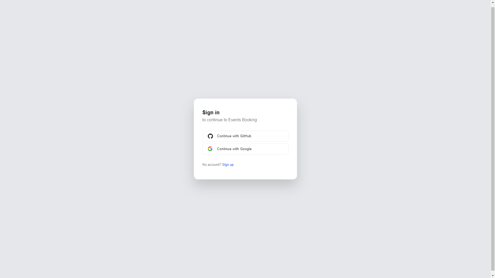

# Event Booking App

Este projeto é uma aplicação de reserva de eventos (Event Booking App) desenvolvida com Next.js, utilizando Clerk para autenticação de usuários, MongoDB como banco de dados, e estilização com NextUI.

## Índice

- [Visão Geral](#visão-geral)
- [Funcionalidades](#funcionalidades)
- [Imagens da Aplicação](#imagens-da-aplicação)
- [Tecnologias Utilizadas](#tecnologias-utilizadas)
- [Pré-requisitos](#pré-requisitos)
- [Instalação](#instalação)
- [Configuração de Variáveis de Ambiente](#configuração-de-variáveis-de-ambiente)
- [Rodando o Projeto](#rodando-o-projeto)
- [Contribuição](#contribuição)
- [Licença](#licença)

## Visão Geral

Este **Event Booking App** permite que usuários visualizem, reservem e gerenciem ingressos para eventos. A aplicação oferece autenticação segura via **Clerk**, um banco de dados eficiente com **MongoDB** para armazenar informações dos eventos e reservas, e uma interface elegante com **NextUI**.

## Funcionalidades

- Autenticação com Clerk (sign in/sign up)
- Gerenciamento de banco de dados com MongoDB
- Interface estilizada com NextUI
- Integração com Stripe para pagamentos
- Firebase para gerenciamento de dados adicionais

## Imagens da Aplicação

Aqui estão algumas capturas de tela da interface da aplicação:

<table>
  <tr>
    <td></td>
    <td></td>
  </tr>
  <tr>
    <td></td>
    <td></td>
  </tr>
  <tr>
    <td></td>
    <td></td>
  </tr>
  <tr>
    <td></td>
    <td></td>
  </tr>
  <tr>
    <td></td>
    <td></td>
  </tr>
</table>

## Tecnologias Utilizadas

- [Next.js](https://nextjs.org/) - Framework React
- [MongoDB](https://www.mongodb.com/) - Banco de dados NoSQL
- [Clerk](https://clerk.dev/) - Autenticação e gerenciamento de usuários
- [NextUI](https://nextui.org/) - Biblioteca de componentes UI
- [Stripe](https://stripe.com/) - Processamento de pagamentos
- [Firebase](https://firebase.google.com/) - Backend para serviços de nuvem

## Pré-requisitos

- Node.js >= 14.x
- MongoDB
- Conta Clerk
- Conta Firebase
- Conta Stripe

## Instalação

1. Clone o repositório:

   ```bash
   git clone https://github.com/Grazziano/events-booking.git
   cd events-booking
   ```

2. Instale as dependências:

   ```bash
   npm install
   ```

## Configuração de Variáveis de Ambiente

Antes de rodar o projeto, crie um arquivo `.env.local` na raiz do projeto e adicione as seguintes variáveis de ambiente:

```bash
# Clerk Auth
NEXT_PUBLIC_CLERK_PUBLISHABLE_KEY=
CLERK_SECRET_KEY=

NEXT_PUBLIC_CLERK_SIGN_IN_URL=/sign-in
NEXT_PUBLIC_CLERK_SIGN_UP_URL=/sign-up
NEXT_PUBLIC_CLERK_AFTER_SIGN_IN_URL=/
NEXT_PUBLIC_CLERK_AFTER_SIGN_UP_URL=/

# MongoDB
MONGO_URL=

# Firebase
NEXT_PUBLIC_FIREBASE_API_KEY=
NEXT_PUBLIC_FIREBASE_DOMAIN=
NEXT_PUBLIC_FIREBASE_PROJECT_ID=
NEXT_PUBLIC_FIREBASE_STORAGE_BUCKET=
NEXT_PUBLIC_FIREBASE_MESSAGING_SENDER_ID=
NEXT_PUBLIC_FIREBASE_APP_ID=
NEXT_PUBLIC_FIREBASE_MEASUREMENT_ID=

# Stripe
NEXT_PUBLIC_STRIPE_PUBLISHABLE_KEY=
STRIPE_SECRET_KEY=

NEXT_PUBLIC_DOMAIN=http://localhost:3000
```

## Rodando o Projeto

1. Certifique-se que o MongoDB está rodando localmente ou na nuvem.
2. Inicie o servidor de desenvolvimento:

   ```bash
   npm run dev
   ```

3. Abra [http://localhost:3000](http://localhost:3000) no seu navegador para ver o resultado.

## Contribuição

Contribuições são bem-vindas! Sinta-se à vontade para abrir um pull request ou relatar problemas no repositório.

## Licença

Distribuído sob a licença MIT. Veja `LICENSE` para mais informações.
